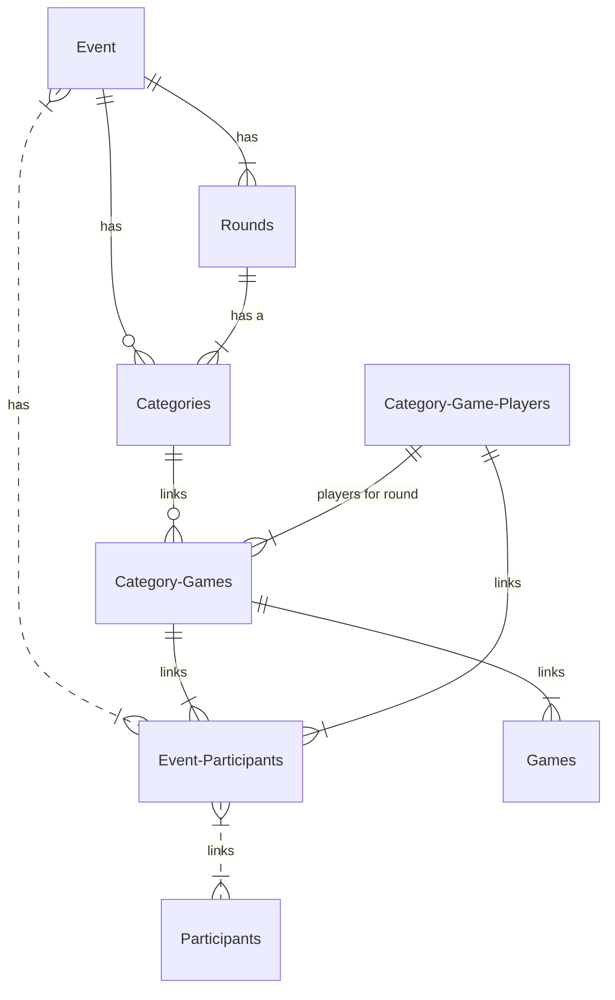

# BoardGameOlympics
This application is for both admins and players at the Board Game Olympics. 

# Admin
## Create Event

###### Add Category
Add a category and a list of games

###### Signup Participant
Add a participant to the current event

###### Register Participant
lookup an existing participant and register them at the doot

