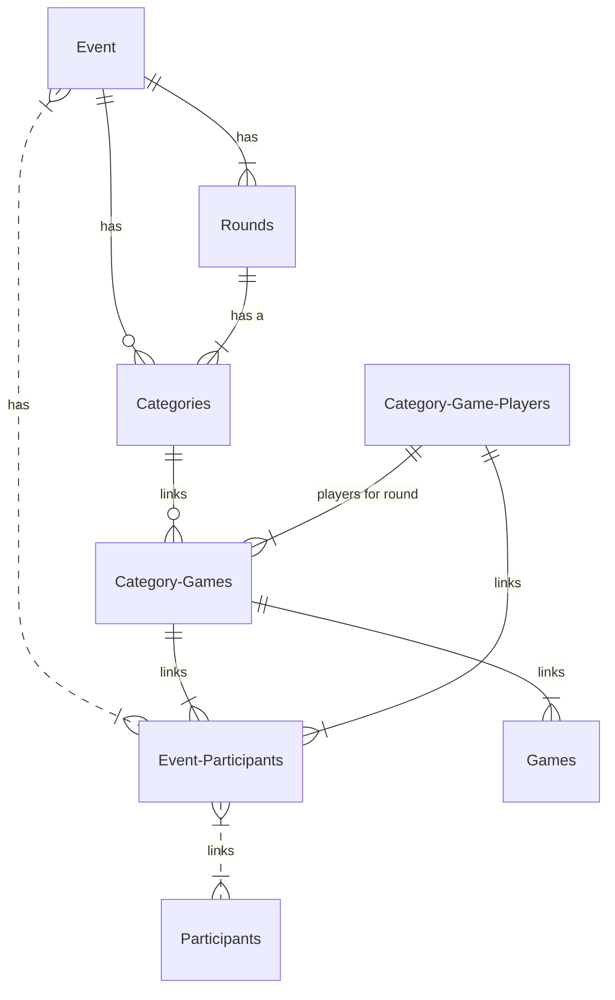

# BoardGameOlympics
This application is for both admins and players at the Board Game Olympics. 

# Feature List
## Create Event [Event]

###### Add Categories
Add a category [Categories] and a list of games to each category [Category-Games]

###### Signup Participant
Add a participant [Participants] and link to the current event ][Event-Participants]

###### Register Participant
Lookup an existing participant and register them at the door [Event-Participants].Active

###### Start Round
Assign round number to one of the categories [Categories]

List current active participants

Assign each participant to a Category-Game until it is full [Category-Game-Players]

###### Save Game Results
Lookup Game [Category-Games] 
Display Details including players [Category-Game-Players]
Add score for each player [Category-Game-Players].Score,  [Category-Game-Players].Points

###### List Results
Group by player [Category-Game-Players] and sum the Points.
Pivot games into table columns [Category-Game-Players]

###### Display Player
Display all games for a player order by category [Category-Game-Players] [Categories] [Games]

